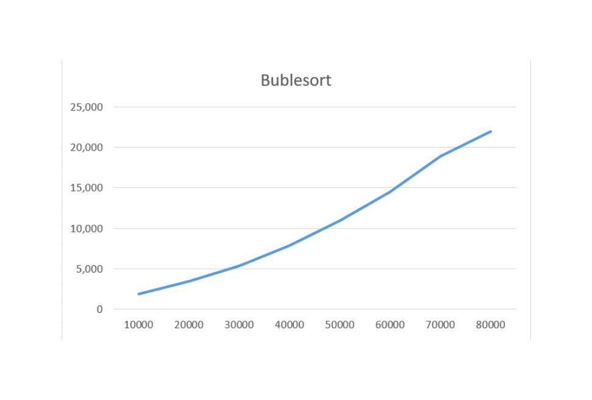
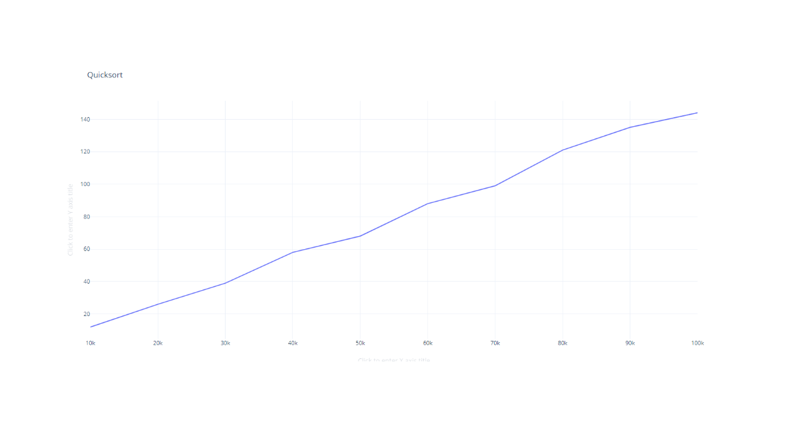
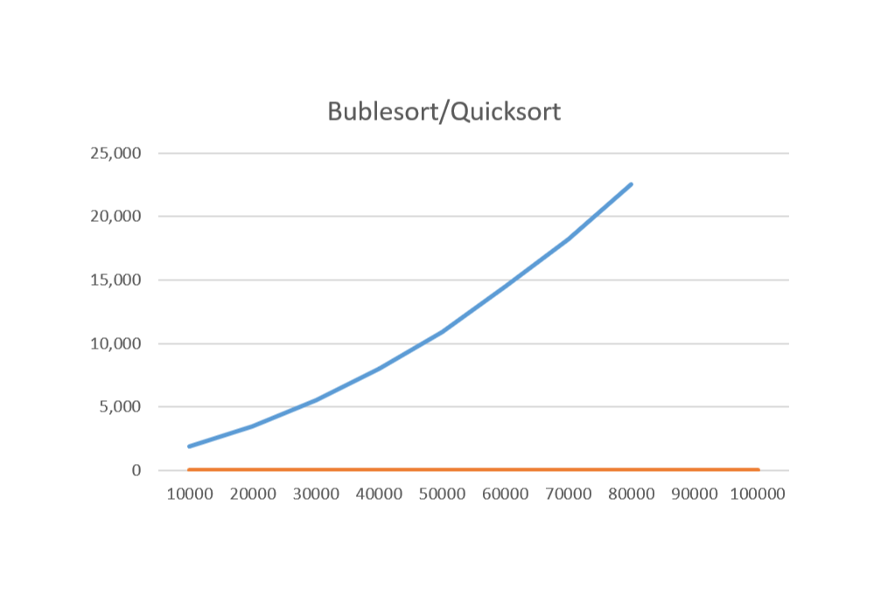

# ULOHA 2
=========

BUBLE SORT

		Time

10000	0,191

20000	0,845

30000	1,889

40000	3,446

50000	5,383

60000	7,842

70000	10,896

80000	14,082

90000	17,894

100000	21,003

>*Modifikujte program tak, aby do meraného času nezapočítaval čas načítavania dát, odmerajte spotrebu času a zostavte graf.*

        Buble 1	Buble 2
10000	0,191	0,189
20000	0,845	0,821
30000	1,889	1,926
40000	3,446	3,465
50000	5,383	5,565
60000	7,842	8,048
70000	10,896	10,912
80000	14,482	14,491
90000	18,894	18,174
100000	22,003	22,565

>*Modifikujte program tak, aby usporiadal čísla od najväčšieho po najmenšie.*

Je potrtebne len vymenit porovnavajucy znak v IF

			if (num[poc1] > num[poc1 + 1] ) { 
				temp = num[poc1];
				num[poc1] = num[poc1 + 1];
				num[poc1 + 1] = temp;
			}

# ULOHA 3
=========

Quicksort

0,0012
0,0026
0,0039
0,0058
0,0068
0,0088
0,0099
0,0121
0,0135
0,0144

# ULOHA 4
=========

# ULOHA 5
=========
>*Navrhnite optimálny algoritmus z hľadiska časovej zložitosti a určte ju. Implementujte ho v jazyku C.*

_____________________________________________________________________________________________________________________________________________________________________________________________
>*Navrhnite optimálny algoritmus, z hľadiska časovej zložitosti, umožňujúci medzi prvými 100 000 číslami uloženými v súbore nums.num nájsť najvyššiu hodnotu a druhú najvyššiu hodnotu. Určte časovú zložitosť tohto algoritmu a implementujte ho v jazyku C.*

a. Zostavte algoritmus tak, že nájdené maximálne hodnoty môžu byť zhodné.
b. Zostavte algoritmus tak, že nájdené maximálne hodnoty nemôžu byť zhodné.

Pre tieto dva algoritmy máme časovú zložitosť O(N), pretože máme jeden cyklus, ktorý overuje N prvkov.

_____________________________________________________________________________________________________________________________________________________________________________________________
>*Navrhnite optimálny algoritmus, z hľadiska časovej zložitosti, umožňujúci spočítať všetky prirodzené čísla od 1 do n. Určte časovú zložitosť tohto algoritmu a implementujte ho v jazyku C*

Mame známy vzorec na súčet aritmetickej postupnosti
S = N(N+1)/2     je casovo nezavisly O(1)

_____________________________________________________________________________________________________________________________________________________________________________________________
>*Navrhnite optimálny algoritmus, z hľadiska časovej zložitosti, umožňujúci spočítať, koľko je v súbore nums.num čísel 0, 1, 2, ... , 65533, 65534, 65535. Aká je pamäťová komplexnosť algoritmu? Ako sa bude meniť pamäťová komplexnosť so stúpajúcim počtom spracovávaných čísel zo súboru nums.num?*

Pre túto úlohu máme tiež lineárnu závislosť O(2N) = O(N), pretože máme len jeden cyklus, ktorý číta N prvkov a následne pridáva jednotku k príslušnému indexu v poli.

Potrebujeme pole na počítanie výskytov pre všetky možné hodnoty čísel (65536 možností), čo znamená, že pamäťová zložitosť je O(1) a je konstantna pretože veľkosť pamäte závisí len na rozsahu hodnôt 65536, nie na počte čísel v súbore.